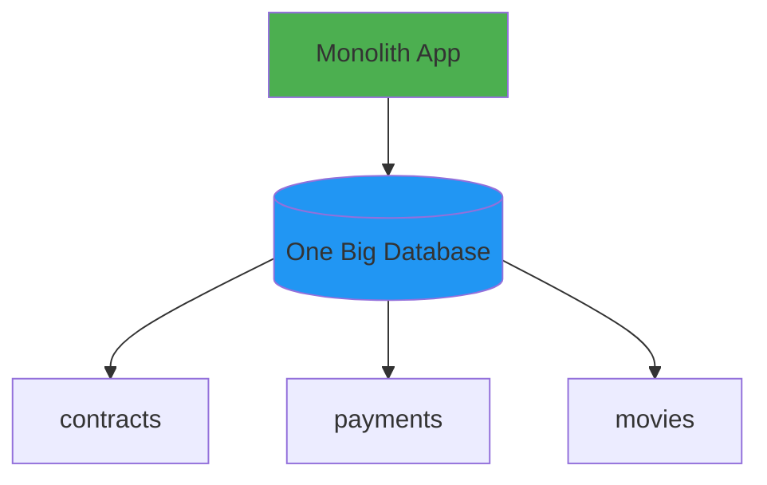
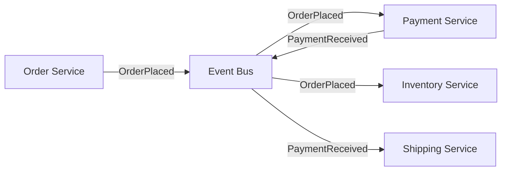
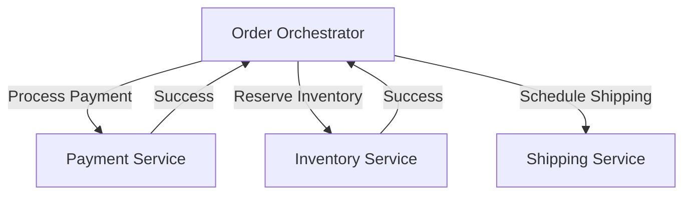

+++
title = "Event-Driven Architecture"
date = "2026-01-19T16:48:37.996Z"
description = ""

[taxonomies]
tags = [ "system-design" ]  
[extra]
growth = "growing"
+++

## why transactions get weird when you split things up

So here's the thing about monoliths - they're actually pretty nice for transactions. Everything lives in one database, so keeping track of what's happening is straightforward.

### the setup

Let's say I'm building a streaming service. Started with indie films, but now we're landing bigger deals. Just signed with Disney to stream Star Wars for $50M (yeah, that's a lot).

In our monolith, legal contracts, payments, and content all live together in one app with one database.



### how it works (the easy version)

When I activate that Disney deal, I need to:
1. Process the $50M payment
2. Make Star Wars visible to users

With one database, it's dead simple:

```sql
BEGIN TRANSACTION;
  
  INSERT INTO payments (contract_id, amount, status, created_at)
  VALUES (1001, 50000000, 'PAID', NOW());
  
  UPDATE accounts 
  SET balance = balance - 50000000 
  WHERE account_id = 1;
  
  UPDATE movies 
  SET is_visible = true, available_date = NOW()
  WHERE contract_id = 1001;
  
  UPDATE contracts 
  SET status = 'ACTIVE', activated_at = NOW()
  WHERE id = 1001;

COMMIT;
```

The beautiful thing here? If my server crashes mid-transaction, the database just rolls everything back automatically. It's like it never happened.

```sql
BEGIN TRANSACTION;
  INSERT INTO payments (...);        -- ✅ ran
  UPDATE accounts SET balance = ...; -- ✅ ran
  UPDATE movies SET is_visible = ...; -- ✅ ran
  -- 💥 crash!
  UPDATE contracts SET status = ...;  -- ❌ never got here
COMMIT; -- ❌ never reached
```

Result? Nothing changed. No half-paid contract, no invisible-but-paid-for movies. The database guarantees this (it's called ACID, but I won't bore you with that right now).

### where it gets messy

But what if the payment processing isn't in our database? Like, what if we're using Stripe or some other payment service?

```sql
-- this literally doesn't work
BEGIN TRANSACTION;
  POST https://stripe.com/api/charge  -- this is a different system!
  UPDATE movies SET is_visible = true;
COMMIT;
```

Now we have problems:
- Payment goes through, server crashes → users don't get their movies
- Our database updates, but Stripe is down → free movies!
- Stripe times out but actually charged them → who knows what happened?

This is where I started looking into event-driven architecture.

## events to the rescue (maybe?)

The core idea: instead of calling APIs directly, services talk by publishing events. An event is just "something happened" - it's immutable, timestamped, you get the idea.

**The pieces:**
- **Producers** publish events when stuff happens
- **Event bus** routes events (like Kafka or RabbitMQ)
- **Consumers** subscribe and react to events
- **Event store** (optional) keeps a log of everything

**Types of events I've seen:**
- Domain events: `OrderPlaced`, `PaymentReceived` (business stuff)
- Integration events: for talking between services
- System events: `ServerStarted`, `CacheCleared` (boring infrastructure stuff)

## two ways to coordinate: choreography vs orchestration

This is where it gets interesting. You can handle workflows two ways:

### choreography (everyone does their own thing)

Each service just reacts to events it cares about. No boss telling everyone what to do.



Pros: services are super decoupled, nothing's a single point of failure  
Cons: good luck figuring out what's happening when debugging

### orchestration (one service runs the show)

A coordinator tells everyone what to do, step by step.



Pros: way easier to understand and debug  
Cons: the orchestrator becomes critical infrastructure (and a bottleneck)

## solving the Disney problem with events

So how do I actually handle that contract with events? Here's one way:

```javascript
// my content service fires the event
async function signContract(studioId, amount, movieIds) {
  // I use the outbox pattern here (more on that later)
  await db.transaction(async (tx) => {
    await tx.insert('contracts', {
      studio_id: studioId,
      amount: amount,
      status: 'PENDING'
    });
    
    await tx.insert('outbox_events', {
      event_type: 'ContractSigned',
      payload: { studioId, amount, movieIds },
      status: 'PENDING'
    });
  });
  
  // background worker picks this up and publishes
  await eventBus.publish('ContractSigned', {
    contractId: contract.id,
    studioId, amount, movieIds
  });
}

// finance service listens for contracts
eventBus.subscribe('ContractSigned', async (event) => {
  const { contractId, amount } = event.payload;
  
  try {
    await paymentAPI.charge(amount);
    
    await eventBus.publish('PaymentProcessed', {
      contractId, amount, status: 'SUCCESS'
    });
  } catch (error) {
    await eventBus.publish('PaymentFailed', {
      contractId, reason: error.message
    });
  }
});

// content service reacts to payment success
eventBus.subscribe('PaymentProcessed', async (event) => {
  await db.update('movies')
    .where({ contract_id: event.payload.contractId })
    .set({ is_visible: true });
});

// or failure
eventBus.subscribe('PaymentFailed', async (event) => {
  await db.update('contracts')
    .where({ id: event.payload.contractId })
    .set({ status: 'FAILED' });
    
  await notificationService.alert('oh no, payment failed!');
});
```

## eventual consistency (learning to let go)

Here's the mental shift: you give up on everything being consistent *right now*. Instead, the system eventually gets consistent.

Think about Amazon orders:
1. "Order placed!" (instant)
2. "Payment successful" (few seconds later)
3. "Preparing shipment" (a minute later)

Each step is async. You're not blocking on anything. It works because you accept the delay.

## sagas (or: how to undo distributed stuff)

A saga is basically a chain of transactions. If something fails partway through, you run "compensating transactions" to undo what you did.

Example flow:
```
Order Placed
  → Reserve Inventory (✓)
    → Process Payment (✗ failed!)
      → Release Inventory (compensate)
        → Cancel Order
```

Forward path: order → inventory → payment → ship  
Rollback path: payment failed → release inventory → cancel

It's like database rollback, but you have to code it yourself. Fun times.

## the outbox pattern (aka: making events reliable)

Problem: what if you update your DB but crash before publishing the event?

Solution: write the event to your database in the *same* transaction as your business data.

```sql
BEGIN TRANSACTION;
  UPDATE orders SET status = 'CONFIRMED';
  INSERT INTO outbox_events (event_type, payload) 
    VALUES ('OrderConfirmed', '{"orderId": 123}');
COMMIT;
```

Then a background worker:
1. Polls the outbox table
2. Publishes pending events
3. Marks them as sent

Now the event survives crashes. You get at-least-once delivery for free.

## things I've learned the hard way

### idempotency is non-negotiable

Events can (will) be delivered multiple times. Your handlers need to be okay with that.

```javascript
async function processPayment(event) {
  const { paymentId } = event.payload;
  
  // always check if we already did this
  const existing = await db.findOne('payments', { id: paymentId });
  if (existing) return; // already handled
  
  // process payment...
}
```

### version your events

Events are contracts between services. When you need to change them, version them:

```javascript
{
  eventType: 'OrderPlaced',
  version: 2,  // bumped this when I added coupon codes
  payload: {
    orderId: 123,
    userId: 456,
    couponCode: 'SAVE20'  // new in v2
  }
}
```

### dead letter queues save your sanity

When an event keeps failing, don't retry forever. Move it to a dead letter queue and deal with it manually.

### observability or you're flying blind

- Correlation IDs to track events across services
- Log everything (publish + consume)
- Monitor lag between event creation and processing

## is it worth it?

**When events make sense:**
- Microservices (kind of the whole point)
- Async workflows
- Need to scale horizontally
- Want an audit trail
- Integrating with external systems

**When they don't:**
- Simple CRUD app
- Need immediate consistency
- Small team, small app
- Nobody on the team has done this before

Honestly? Event-driven systems are harder to reason about. Debugging is a pain. But when you need to scale or integrate disparate systems, sometimes it's the best tool for the job.

Still figuring this out myself... will update as I learn more.
